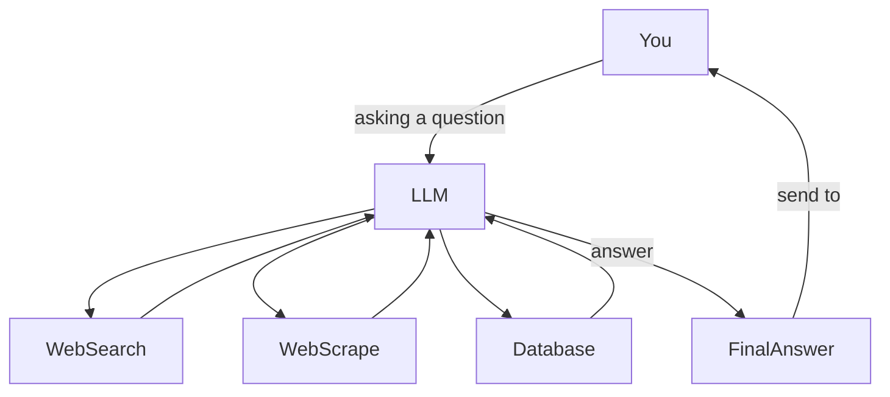

# LLocalSearch

## What it is and what it does

[demo.webm](https://github.com/nilsherzig/LLocalSearch/assets/72463901/e13e2531-05a8-40af-8551-965ed9d24eb4)


LLocalSearch is a wrapper around locally running `Large Language Models` (like ChatGTP, but a lot smaller and less "smart") which allows them to choose from a set of tools. These tools allow them to search the internet for current information about your question. This process is iterative, which means, that the running LLM can freely choose to use tools (even multiple times) based on the information its getting from you and other tool calls. 


Here is a rough representation of how this looks like.



### Features

- 🕵‍♀ Completely local (no need for API keys) and thus a lot more privacy respecting
- 💸 Runs on "low end" hardware (the demo video uses a 300€ GPU)
- 🤓 Live logs and links in the answer allow you do get a better understanding about what the agent is doing and what information the answer is based on. Allowing for a great starting point to dive deeper into your research.
- 🤔 Supports follow up questions
- 📱 Mobile friendly design
- 🌓 Dark and light mode

## Road-map

### I'm currently working on 👷

#### Support for LLama3 🦙

The langchain library im using does not respect the LLama3 stop words, which results in LLama3 starting to hallucinate at the end of a turn. I have a working patch (checkout the experiments branch), but since im unsure if my way is the right way to solve this, im still waiting for a response from the  [langchaingo](https://github.com/tmc/langchaingo) team.

#### Interface overhaul 🌟

An Interface overhaul, allowing for more flexible panels and more efficient use of space. 
Inspired by the current layout of [Obsidian](https://obsidian.md)

#### Support for chat histories / recent conversations 🕵‍♀

Still needs a lot of work, like refactoring a lot of the internal data structures to allow for more better and more flexible ways to expand the functionality in the future without having to rewrite the whole data transmission and interface part again.


### Planed (near future)

#### User Accounts 🙆

Groundwork for private information inside the rag chain, like uploading your own documents, or connecting LLocalSearch to services like Google Drive, or Confluence.

#### Long term memory 🧠

Not sure if there is a right way to implement this, but provide the main agent chain with information about the user, like preferences and having an extra Vector DB Namespace per user for persistent information.

## Install Guide

### Docker 🐳

1. Clone the GitHub Repository

```bash
git@github.com:nilsherzig/LLocalSearch.git
cd LLocalSearch
```

2. Create and edit an `.env` file, if you need to change some of the default settings. This is typically only needed if you have Ollama running on a different device or if you want to build a more complex setup (for more than your personal use f.ex.). Please read [Ollama Setup Guide](./Ollama_Guide.md) if you struggle to get the Ollama connection running.

```bash
touch .env
code .env # open file with vscode
nvim .env # open file with neovim
```

3. Run the containers

```bash
docker-compose up -d
```

